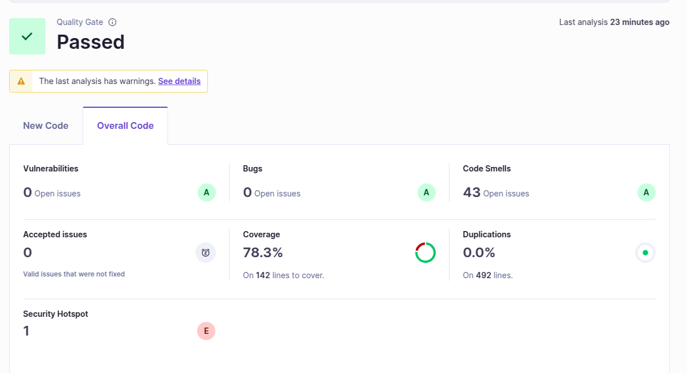

**8.1 f)**
- **Dashboard**

The project passed the quality gate. According to the SonarQube analysis, there are no open bugs or vulnerabilities, and the code duplication is 0%. The code coverage is 78.3%, which meets the required threshold. Although there is one security hotspot and several code smells, these are not too harmful, allowing the project to pass successfully.

---- 
**8.1 g)**

# Sample Issues from SonarQube Analysis

## Maintainability

| Issue Type      | Problem Description                                                                   | How to Solve                                                                                       |
|-----------------|----------------------------------------------------------------------------------------|-----------------------------------------------------------------------------------------------------|
| Maintainability | `import tqs.euromillions.Dip;` — Unnecessary import from the same package.            | Remove the redundant import, as classes in the same package are implicitly imported in Java.        |

## Security Hotspot

| Issue Type        | Problem Description                                                                 | How to Solve                                                                                       |
|-------------------|--------------------------------------------------------------------------------------|-----------------------------------------------------------------------------------------------------|
| Security Hotspot  | Use of weak cryptography: `Random generator = new Random();`                        | Consider using `SecureRandom` instead of `Random` for improved security and cryptographic safety.  |
--- 

**8.1 h)**
## Checkstyle

Checkstyle is a tool that verifies whether the Java code follows a specific coding style and formatting conventions. It helps enforce consistency in code structure, such as indentation, naming, and import order.

## PMD

PMD analyzes Java code to find common programming flaws such as empty catch blocks, unused variables, and overly complex expressions. It is useful for identifying bad practices and maintaining clean code.

## SpotBugs

SpotBugs (formerly FindBugs) is a bytecode analysis tool that detects real bugs in Java code. It identifies issues like null pointer dereferences, concurrency errors, and API misuse.

